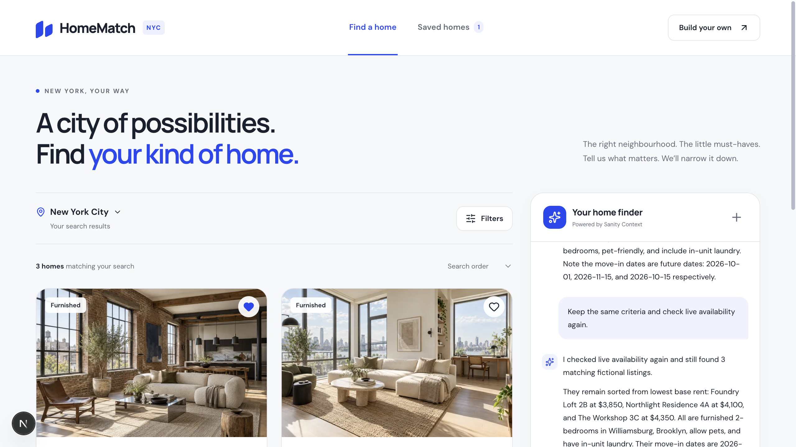
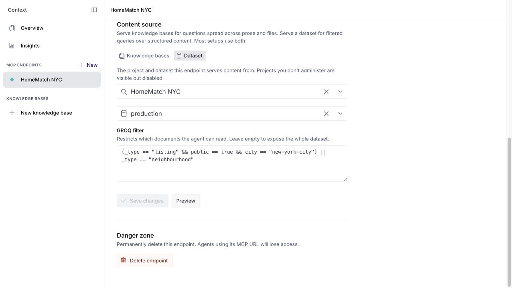
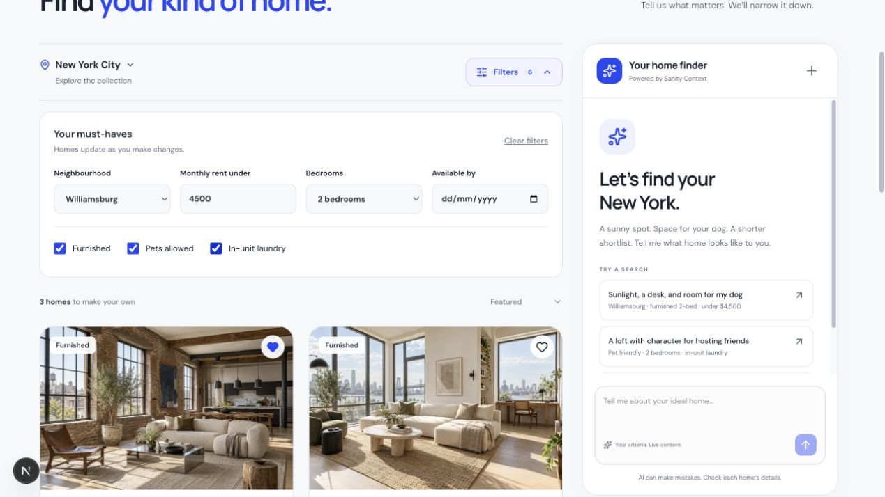
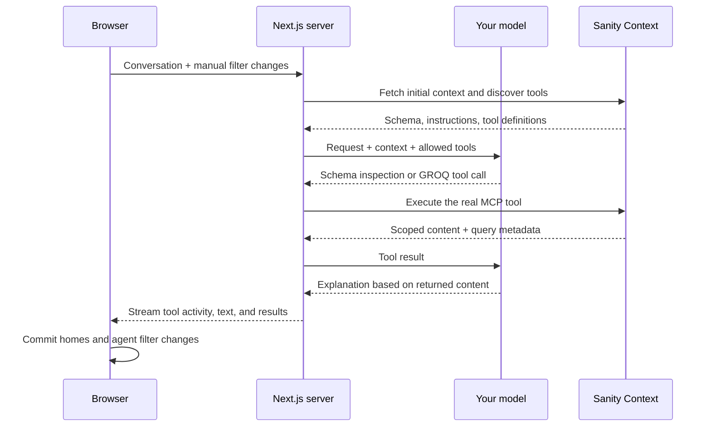
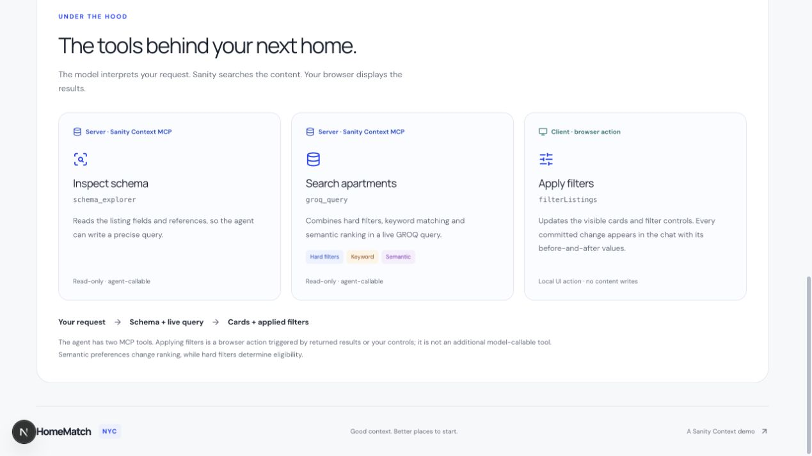
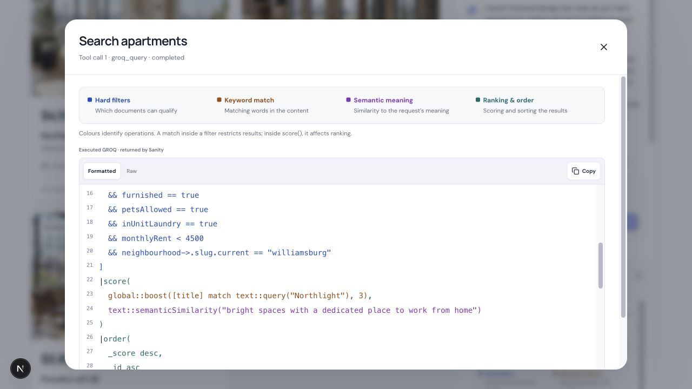

# HomeMatch NYC

Build a custom AI apartment finder with **Next.js, Sanity Context, and the Vercel AI SDK**. Describe the home you want, refine your search in conversation, and inspect the real queries that found your results.

**[Create your Sanity account through Sonny’s signup link →](https://www.sanity.io/sonny)**

This is my link, and I appreciate you using it — it allows me to continue making tutorials like this for absolutely free.



All apartments, prices, dates, descriptions, and images are fictional tutorial content. There is no booking, application, contact, or payment flow.

## Recommended: set up with your coding agent

This is the route used in the tutorial. Give your coding agent Sanity’s official skills, then use the setup prompt supplied by Sanity Dashboard. The [manual setup](#setup) below is an alternative and a reference if you get stuck.

### 1. Open the starter and install the skills

1. Install **Node.js 22.18 or newer**, a code editor with a coding agent (such as Codex, Claude Code, or Cursor), and **pnpm 11**. If pnpm is missing, run `npm install -g pnpm@11.24.0` in your terminal once.
2. On [GitHub](https://github.com/sonnysangha/sanity-context-real-estate-demo-with-ai-agent), select **tutorial/starter → Code → Download ZIP**. Unzip it and open the folder containing `package.json` in your editor. Prefer Git? Use the [clone instructions](#1-clone-the-repository) instead.
3. Open your editor’s terminal and run `pnpm install --frozen-lockfile`.
4. Install the official Sanity skills, one command at a time. Select your coding agent when the installer asks:

```sh
pnpm dlx skills add sanity-io/agent-toolkit
pnpm dlx skills add sanity-io/agent-context
```

The **Agent Toolkit** teaches your assistant Sanity development practices. The **Context skills** help it connect and shape a custom agent. These are instructions for your coding assistant; they are not extra tools exposed to the apartment finder. [Official Sanity skills guide](https://www.sanity.io/docs/ai/skills)

The starter supplies the design, filters, listing details, images, seed data, schemas, and supporting code. **You build the agent connection in `src/app/api/chat/route.ts`.** Its placeholder response is expected until that step is done. Choose `main` if you want the completed agent instead.

### 2. Ask your coding agent to prepare Sanity

[Create your Sanity account](https://www.sanity.io/sonny), then paste this into your coding agent with the repository open:

> Use the installed Sanity skills to prepare this HomeMatch NYC project. Read the README and the current Sanity Context migration guide first. Help me create my Sanity project and private production dataset, copy .env.example to .env.local if needed, configure project tokens securely, seed the supplied apartments, deploy the schema, enable Dataset Embeddings over title, description and features, and make /studio work with credentialed localhost:3000 CORS access. Keep existing content and the interface. Guide me through sign-in and API keys without printing secrets. Stop before connecting the chat agent: I will copy its setup prompt from Sanity Dashboard. Do not set up Insights yet.

Your assistant can use the Sanity CLI and, if connected, the separate [Sanity MCP server](https://www.sanity.io/docs/ai). Follow its sign-in prompts. Skills do not grant account access automatically. If it cannot create a resource, use the matching [manual step below](#setup).

### 3. Copy the endpoint’s setup prompt

1. In **Sanity Dashboard → your organization → Context**, create your **HomeMatch NYC** MCP endpoint. Select **Dataset → your HomeMatch project → production**. Use the [content filter and instructions below](#5-create-the-context-mcp-in-sanity-dashboard), then save.
2. Click **Connect agent** next to the endpoint URL.
3. Select **Set up with AI**.
4. Click **Copy setup prompt**.
5. Paste it into your coding agent, with this extra instruction:

> Connect this endpoint to the existing HomeMatch NYC app. On tutorial/starter, implement the placeholder chat route; on main, configure the existing route. Preserve the newline-delimited JSON events, real tool-call widgets, filtering behavior, and UI. Use the organization Context endpoint and an organization Context Viewer token. Keep credentials server-side. Help me add my model API key privately. Verify an actual search returns Foundry Loft 2B, Northlight Residence 4A, and The Workshop 3C. Leave Agent Insights unconfigured for now.

The Dashboard prompt supplies the connection instructions for your endpoint. Let the assistant inspect the existing project and explain its changes before you run the demo. Do not replace the supplied UI with a different starter application.

### 4. Check the result

Run `pnpm dev`, open [the app](http://localhost:3000), and send the [first demo search](#2-find-the-three-exact-matches). Open [Studio](http://localhost:3000/studio) and confirm the apartments are editable. Your assistant should also run `pnpm context:verify`, `pnpm typecheck`, and `pnpm test`.

Once searching works, follow [the demo walkthrough](#demo-walkthrough). Add [Agent Insights](#add-agent-insights) as a separate step when you reach it in the tutorial.

> **Migrating an older setup?** Create the endpoint in the organization’s Context app, use its new URL and an organization Context Viewer token, and remove the deprecated Studio Context plugin/configuration document after verifying the new connection. Do not create a `sanity.agentContext` document for this tutorial. Older skill text may still show that workflow; follow the [current migration guide](https://www.sanity.io/docs/ai/context-migration-guide).

## Start here

| Your goal                        | Where to go                                                                                              |
| -------------------------------- | -------------------------------------------------------------------------------------------------------- |
| Run the finished app             | [Setup](#setup) on the `main` branch                                                                     |
| Build the agent yourself         | Complete setup on `tutorial/starter`, then [implement the agent](#build-the-agent-on-the-starter-branch) |
| Follow the full demonstration    | [Demo walkthrough](#demo-walkthrough)                                                                    |
| Understand the retrieval         | [Filters, keywords, and meaning](#filters-keywords-and-meaning)                                          |
| Understand the UI and tool calls | [What happens when you search](#what-happens-when-you-search)                                            |
| Fix setup or unexpected results  | [Troubleshooting](#troubleshooting)                                                                      |

## What you are building

The app includes a responsive catalogue, conversational home finder, inline filter accordion, saved homes, apartment details, streaming answers, and collapsible tool activity. The agent can search current Sanity content, preserve criteria across follow-ups, and combine strict requirements with softer preferences.

The stack has distinct jobs:

| Part                    | Job in this project                                                                    |
| ----------------------- | -------------------------------------------------------------------------------------- |
| **Sanity Content Lake** | Stores apartment documents, neighbourhood references, and image assets                 |
| **Sanity Studio**       | Lets you edit the catalogue and publish availability changes                           |
| **Sanity Context**      | Gives the agent scoped, read-only access to the schema and content through MCP         |
| **Dataset Embeddings**  | Supports semantic ranking over the listing descriptions and features                   |
| **OpenAI or Anthropic** | Interprets the request, chooses tools, generates GROQ, and explains the returned homes |
| **Vercel AI SDK**       | Runs the model/tool loop in the Next.js server route                                   |
| **Next.js UI**          | Displays homes, filters, chat, and actual tool activity                                |

Sanity Context is a hosted MCP server, not an off-the-shelf chatbot or the agent loop. You bring the model and harness. The separate **Sanity MCP server** supports content operations, including writes; Context itself is read-only. [Sanity Context overview](https://www.sanity.io/docs/ai/sanity-context)

This demo uses **GROQ mode** because apartment discovery is a structured filtering problem. Knowledge Base mode is designed for locating answers across indexed material. A catalogue with descriptive prose can stay in GROQ mode and add Dataset Embeddings, which is what we do here. Do not add a Knowledge Base to complete this tutorial. [Retrieval modes](https://www.sanity.io/docs/ai/sanity-context-retrieval-modes)

## Before you begin

You need:

- Node.js **22.18 or newer** and **pnpm 11**. The repository pins `pnpm@11.24.0` and includes a lockfile.
- Git and a code editor.
- A [Sanity account](https://www.sanity.io/sonny), an organization where you can enable Context, and permission to create a project and attach its dataset to an MCP.
- An OpenAI **API key** or Anthropic **API key**, with model API access. A consumer chat subscription is not the key used by this application.
- An internet connection for Sanity, asset uploads, and model requests.

Sanity Context retrieval uses ordinary API usage rather than a per-token retrieval fee. Your model provider bills model usage separately. [Sanity Context pricing FAQ](https://www.sanity.io/context)

Semantic queries have their own quota: current Dataset Embeddings documentation says generation and updates are included, while calls using `text::semanticSimilarity()` count against your organization’s semantic search quota. Check your account’s allowances and [current Sanity pricing](https://www.sanity.io/pricing) before running repeated searches. [Dataset Embeddings billing](https://www.sanity.io/docs/content-lake/dataset-embeddings)

## Setup

**Manual alternative:** follow these steps if you prefer to configure the project yourself. If you used the coding-agent route above, use this section only to check individual settings; do not create duplicate projects or tokens.

Run commands from the repository root. Replace placeholders with values from your own Sanity project and organization.

### 1. Clone the repository

For the finished application:

```sh
git clone https://github.com/sonnysangha/sanity-context-real-estate-demo-with-ai-agent.git
cd sanity-context-real-estate-demo-with-ai-agent
pnpm install --frozen-lockfile
cp .env.example .env.local
```

To implement the agent during the tutorial, choose the starter **before making changes**:

```sh
git switch tutorial/starter
```

The starter already includes the interface, content schemas, seed data, images, and supporting helpers. Its `/api/chat` route intentionally returns **HTTP 501** until you implement it. Environment setup alone does not complete that exercise. Stay on `main` if you want to run the finished demonstration immediately.

### 2. Sign in and create your project

[Sign up through Sonny’s link](https://www.sanity.io/sonny), then authenticate the CLI:

```sh
pnpm exec sanity login
pnpm exec sanity projects create "HomeMatch NYC" --dataset production --dataset-visibility private
```

Select your organization when prompted. Copy the new project ID into `.env.local`:

```dotenv
NEXT_PUBLIC_SANITY_PROJECT_ID=your_project_id
NEXT_PUBLIC_SANITY_DATASET=production
```

Keep the dataset private. The app reads public catalogue content through its server; it does not give anonymous browsers a dataset token.

### 3. Create project tokens and seed the catalogue

```sh
pnpm setup:tokens
pnpm seed
```

`setup:tokens` uses your logged-in CLI session to create a project Viewer token and a project Editor token. It saves them to `.env.local` without printing their values and keeps existing configured tokens. You need permission to create API tokens in this project.

`seed` uploads the included images and creates the named tutorial documents using `createIfNotExists`. Running it again does not overwrite existing listing edits or create duplicate listing documents.

The dataset contains:

| Content                      | Count | Purpose                                                  |
| ---------------------------- | ----: | -------------------------------------------------------- |
| Apartment documents          |    13 | Three hero matches plus deliberate near misses           |
| Public apartments            |    12 | Includes one already rented apartment                    |
| Public, available apartments |    11 | Initial browse results                                   |
| Private apartment            |     1 | Checks that public access scoping excludes it            |
| Neighbourhood documents      |     4 | Williamsburg, Greenpoint, Long Island City, East Village |
| Distinct interior images     |    13 | Included locally; no image-generation account required   |

Source data is in [seed/listings.json](seed/listings.json). Images are in [public/apartments](public/apartments), with [provenance information](public/apartments/README.md).

### 4. Deploy Studio and its schema

```sh
pnpm exec sanity deploy --url your-unique-homematch-name --yes --schema-required
```

Choose a unique Studio hostname. Open the returned Studio URL, sign in, and confirm the Apartment and Neighbourhood documents appear.

The project also provides an embedded Studio at `http://localhost:3000/studio` once Next.js is running. In your project’s **API → CORS origins**, add **http://localhost:3000** and enable **Allow credentials**, then sign in to Studio. This lets the editor authenticate from your local app. Alternatively, run:

```sh
pnpm exec sanity cors add http://localhost:3000 --credentials
```

You can run a separate local Studio with `pnpm studio`; that uses port 3333 and needs its own allowed origin.

After changing the schema, run:

```sh
pnpm schema:deploy
```

Redeploy Studio when you want its hosted editing interface to reflect schema/UI changes. A deployed schema is required for Context’s dataset tools. [Context requirements](https://www.sanity.io/docs/ai/sanity-context)

### 5. Create the Context MCP in Sanity Dashboard

1. Open [Sanity Dashboard](https://www.sanity.io/welcome), select your organization, and open **Context**.
2. If Context is missing, an organization admin can enable it in **Manage → Apps**.
3. Create an MCP. Give it a title such as **HomeMatch NYC** and a stable name such as `homematch-nyc`.
4. Add a **dataset source**: `YOUR_PROJECT_ID.production`.
5. Add the content filter below and paste the instructions beneath it.
6. Save. For the recommended approach, click **Connect agent → Set up with AI → Copy setup prompt**, then [paste it into your coding agent](#3-copy-the-endpoints-setup-prompt). For manual setup, copy the endpoint URL and continue below.

The dataset source selects GROQ mode; there is no separate required mode field to set. The endpoint name becomes part of its URL. [MCP configuration reference](https://www.sanity.io/docs/ai/sanity-context-mcp)

**Content filter** — paste this expression, not a complete `*[...]` query:

```groq
(_type == "listing" && public == true && city == "new-york-city")
  || _type == "neighbourhood"
```

This scopes retrieval to public NYC listings and the neighbourhood documents needed to follow references. Availability remains a per-search condition, so the agent can understand a listing’s status within that public scope.

**Instructions** — paste into the MCP’s instructions field:

> All apartments in this catalogue are fictional. Each listing describes one individual unit, not a whole building. monthlyRent is monthly base rent in USD; utilities and fees are not represented. Only show public listings whose status is available. availableFrom is a YYYY-MM-DD date-only string: compare it directly with a quoted YYYY-MM-DD string, without dateTime(). Explain future move-in dates. Preserve all hard criteria on follow-up requests. Pets and in-unit laundry are explicit boolean fields; shared laundry does not qualify. Preferences change ranking only, and must not exclude otherwise eligible homes. Keep exact building-name preferences inside score(), not the hard filter. Be concise and warm. If nothing matches, say so and ask which constraint the viewer wants to change. Do not book, apply, invent listings, or silently broaden a search.

These are also in [docs/context-instructions.md](docs/context-instructions.md). Configuration is managed in the Context app; follow the [Configure an MCP guide](https://www.sanity.io/docs/ai/sanity-context-configure-mcp) if your Dashboard layout differs.

The seeded scope contains **16 documents**: 12 public listings and four neighbourhoods. Preview the source filter in Dashboard to check this count.



### 6. Create an organization Context token

In your organization’s **Manage → API → Tokens**, create an organization API token with **Context Viewer** permissions. Save it directly in `.env.local` together with the endpoint URL:

```dotenv
SANITY_CONTEXT_MCP_URL=https://api.sanity.io/v1/context/organizations/YOUR_ORG_ID/mcp/homematch-nyc
SANITY_ORGANIZATION_TOKEN=your_organization_context_viewer_token
```

Copy the actual endpoint from Dashboard rather than guessing your organization ID or endpoint name. `SANITY_ORGANIZATION_ID` exists in the example environment file but is not needed by the runtime when the full URL is provided.

A project Viewer token and an organization Context Viewer token serve different purposes. Project tokens are not accepted by this organization MCP endpoint. Attaching a dataset requires the appropriate source-project administrative access. [Context access and security](https://www.sanity.io/docs/ai/sanity-context-security)

### 7. Enable Dataset Embeddings

```sh
pnpm exec sanity datasets embeddings enable production --projection '{title, description, features}' --wait
pnpm exec sanity datasets embeddings status production
```

Wait until status is `ready`. This projection selects the prose fields relevant to atmosphere, daylight, and workspace; price, date, and amenities remain structured fields.

Embeddings update asynchronously after content changes. A newly published rent or status is read directly by the hard filter; it does not need to wait for the descriptive text’s embedding to refresh. `_score` is relative to a query, not a confidence percentage. [Dataset Embeddings](https://www.sanity.io/docs/content-lake/dataset-embeddings)

Context advertises semantic support when applicable. If `text::semanticSimilarity()` is missing from the discovered tool description, check readiness and the project’s applicable AI usage allowance. Do not mistake keyword-only retrieval for the full semantic demonstration. [Context text search](https://www.sanity.io/docs/ai/sanity-context-mcp)

### 8. Add a model API key

Set one provider in `.env.local`:

```dotenv
OPENAI_API_KEY=your_openai_api_key
# Or use ANTHROPIC_API_KEY instead.
```

The current route defaults to `gpt-5.4` for OpenAI and `claude-sonnet-4-6` for Anthropic. `AI_MODEL` overrides the selected provider’s model ID. If both keys are present, **Anthropic takes precedence**. Choose a model that supports tool calling and is available to your account.

| Environment variable                    | Used for                                     | Exposure                         |
| --------------------------------------- | -------------------------------------------- | -------------------------------- |
| `NEXT_PUBLIC_SANITY_PROJECT_ID`         | Selects your project                         | Public identifier                |
| `NEXT_PUBLIC_SANITY_DATASET`            | Selects your dataset                         | Public identifier                |
| `SANITY_API_READ_TOKEN`                 | Initial catalogue, details, saved-home reads | Server only; project Viewer      |
| `SANITY_API_WRITE_TOKEN`                | Seed/reset/status scripts                    | Local setup only; project Editor |
| `SANITY_CONTEXT_MCP_URL`                | Hosted Context connection                    | Configured on the server         |
| `SANITY_ORGANIZATION_TOKEN`             | Organization MCP authentication              | Server only; Context Viewer      |
| `OPENAI_API_KEY` or `ANTHROPIC_API_KEY` | Model API calls                              | Server only                      |
| `AI_MODEL`                              | Optional model override                      | Server configuration             |

### 9. Verify and run

```sh
pnpm context:verify
pnpm dev
```

`context:verify` discovers hosted MCP tools and executes a real GROQ query. With an untouched seed, it must report:

```text
Foundry Loft 2B, Northlight Residence 4A, The Workshop 3C
```

This command does not call your LLM. It checks the Context connection and structured retrieval; it does not prove semantic ranking or the complete agent loop. Local debug artifacts go into ignored `.runtime/`.

Open [localhost:3000](http://localhost:3000). You should see **11 homes** before searching. Restart the dev server after changing environment values.

On `main`, proceed to the walkthrough. On `tutorial/starter`, complete the route below first.

## Build the agent on the starter branch

The exercise is [src/app/api/chat/route.ts](src/app/api/chat/route.ts). Its intentional 501 response is your starting point. The completed route is available on [main](https://github.com/sonnysangha/sanity-context-real-estate-demo-with-ai-agent/blob/main/src/app/api/chat/route.ts).

Implement these pieces in order:

1. **Validate requests and load settings.** Accept the conversation and `threadId`; validate optional manual filter metadata with `manualFiltersSchema`. Read all credentials on the server. Restrict the MCP URL to the Sanity HTTPS host.
2. **Prepare the connection.** Pin `perspective=published`, apply `contextScope`, and enable the embeddings connection option. Select the organization token for the organization endpoint.
3. **Load initial context.** Fetch the endpoint’s `/initial-context` path using the same bearer token. Combine that schema/domain context with `agentInstructions` from [agent-contract.ts](src/lib/agent-contract.ts).
4. **Discover real MCP tools.** Use `createMCPClient` from `@ai-sdk/mcp` with HTTP transport. Pass only `schema_explorer` and `groq_query` to the model. Do not create a fake local search tool with the same name.
5. **Run the model/tool loop.** Use `streamText` with the selected provider, conversation, and tools. Use `withManualFilterContext` to incorporate browser changes into the model input. The complete route limits the loop to six steps and supports cancellation.
6. **Validate query output.** Unpack MCP responses with `unpackMcp`; validate listing arrays with `listingSchema`. Keep the full card projection, including IDs, referenced neighbourhood fields, and image URLs. Attach executed-query metadata when returned; otherwise label the trace as submitted.
7. **Stream events the UI understands.** Wrap actual tool execution to emit running/completed/error tool events. Include `filters: queryFilters(trace.query)` on result events so the browser can synchronize supported controls.
8. **Finish and clean up.** Send `done` only after the stream succeeds. Close the MCP client on success/error; abort work on Stop or timeout. A failed query must not become an invented successful result.

The existing UI expects **newline-delimited JSON**, not the AI SDK’s default UI-message stream:

| Event `type` | What to send                                                                                      |
| ------------ | ------------------------------------------------------------------------------------------------- |
| `status`     | Short progress `text`                                                                             |
| `tool`       | An `AgentToolCall` with a stable ID, tool name, status, visible input, and eventual trace/summary |
| `results`    | Validated `listings`, `trace`, and extracted `filters`                                            |
| `text`       | A text delta                                                                                      |
| `done`       | Successful stream completion                                                                      |
| `error`      | A user-readable failure `text`                                                                    |

Refer to [types.ts](src/lib/types.ts), [chat-transcript.ts](src/lib/chat-transcript.ts), and [home-match.tsx](src/components/home-match.tsx) for the exact contracts. Study the [official Vercel AI SDK integration](https://www.sanity.io/docs/ai/sanity-context-vercel-ai-sdk) for the MCP connection pattern; retain this repository’s event protocol for its UI.

To compare without changing your branch:

```sh
git show origin/main:src/app/api/chat/route.ts
```

To use the completed solution after saving your exercise work, this intentionally replaces **only** the route with the finished version:

```sh
git restore --source=origin/main -- src/app/api/chat/route.ts
```

Then run `pnpm typecheck`, `pnpm test`, and the live suggestions check described below.

## Demo walkthrough

Use the seeded data. Dates are fixed tutorial values in 2026, not relative to today. `status: available` means the unit can be offered; `availableFrom` is its earliest move-in date. Rent is monthly **base rent**, excluding any unmodeled fees or utilities.

### 1. Open the filters and browse

Click **Filters** above the homes. The inline accordion expands downward and stays open while you edit it. Try a neighbourhood, bedroom count, and budget. Homes update immediately. Clear those choices before the first chat search.

Manual eligibility edits use the full loaded catalogue, so broadening a previous agent search can bring homes back. Sorting alone keeps the current result set. A manual edit creates **no chat message or widget**. Its validated changes accompany your next message so “check again” uses the updated criteria. These controls do not make a fresh MCP request by themselves.



### 2. Find the three exact matches

Start a fresh conversation and send:

> Find available furnished two-bedroom apartments in Williamsburg under $4,500 a month that allow pets and have in-unit laundry. Show the lowest rent first.

Expected results:

| Home                    | Base rent/month | Earliest move-in  |
| ----------------------- | --------------: | ----------------- |
| Foundry Loft 2B         |          $3,850 | October 1, 2026   |
| Northlight Residence 4A |          $4,100 | November 15, 2026 |
| The Workshop 3C         |          $4,350 | October 15, 2026  |

Expand **Behind this search → Search apartments** in the chat. Inspect the actual hard filters. The agent’s supported filter changes appear in a collapsible **Applied filters** card and synchronize the accordion controls. Only agent-made changes produce that card.

### 3. Refine, then test an empty result

Send:

> Keep everything else the same, but my budget is now under $4,000 a month.

Expect **Foundry Loft 2B only**.

Then:

> What about under $3,000 a month, with everything else the same?

Expect **no matching homes**. The agent should not invent one or silently relax your requirements.

### 4. Add a move-in deadline

Send:

> Put my budget back to under $4,500 a month. Keep the furnished two-bedroom, Williamsburg, pets and in-unit laundry requirements. I need to move in by November 1, 2026.

Expect **Foundry Loft 2B and The Workshop 3C**. Northlight’s November 15 date fails the deadline.

### 5. Add a preference without losing eligible homes

Send:

> I can be flexible on the move-in date. Keep everything else the same, including the budget under $4,500. I'd love a bright place with a proper workspace. Northlight would be my first choice, but please show me other options too.

Expect the original **three eligible homes**, now ranked for the preferences. The precise generated query, scores, and prose may vary between model runs. Inspect the query to confirm the building preference and workspace meaning affect ranking rather than eligibility.

### 6. Try the three opening suggestions

Use **Start a new conversation** between these independent searches. The app contains these same natural-language suggestions:

**Sunlight and a workspace**

> I'm looking for a furnished two-bedroom in Williamsburg for under $4,500 a month. It needs to allow pets and have in-unit laundry. I'd love somewhere bright with a proper place to work from home. Northlight would be my first choice, but I'd like to see other options too.

Expected eligible set: **Foundry, Northlight, Workshop**; preference targets Northlight and a bright workspace.

**A loft for hosting friends**

> Can you find me a furnished two-bedroom in Williamsburg for under $4,500 a month? I need a pet-friendly place with in-unit laundry. I love industrial lofts with exposed brick, an open kitchen and room to have friends over. I'd prefer Foundry, but I'm open to other buildings.

Expected eligible set: **Foundry, Northlight, Workshop**; preference targets Foundry and loft character.

**A creative workspace by November**

> I need a furnished two-bedroom in Williamsburg for under $4,500 a month, with pets allowed and in-unit laundry. I need to move in by November 1, 2026. I'd love a separate quiet spot for creative work. The Workshop would be ideal, but please show me other options too.

Expected eligible set: **Foundry and Workshop**; preference targets Workshop and a quiet creative area.

No user needs to say “semantic,” “keyword,” or “hard filter.” The agent’s instructions translate ordinary preferences into the appropriate retrieval behavior.

### 7. Publish a real availability change

1. Open your Studio and locate **Foundry Loft 2B**.
2. Open its **Availability** group.
3. Change **Status** from Available to Rented, then **Publish**.
4. Return to HomeMatch, start a fresh conversation, and repeat the original three-match search from step 2.
5. Expect **Northlight and Workshop only**.
6. Return to Studio, change Foundry back to Available, and **Publish** again.
7. Repeat the original search to confirm all three are back.

The agent performs a new live query. A draft edit alone is not what this app reads. Existing cards are not a live subscription: run the search again or reload to see published changes. No Next.js redeployment is needed for a content-only update.

Use `pnpm demo:restore` if you need to restore the published Foundry fixture from the terminal. If Studio still has an unpublished draft, discard or reconcile it there before your next demonstration.

## Filters, keywords, and meaning

The three retrieval parts answer different questions:

| Part                | Example                                       | Effect                                         |
| ------------------- | --------------------------------------------- | ---------------------------------------------- |
| Hard requirement    | Two bedrooms; rent under $4,500; pets allowed | Determines which homes are eligible            |
| Keyword preference  | “Northlight would be my first choice”         | Boosts the named building among eligible homes |
| Semantic preference | “A bright place with a proper workspace”      | Ranks descriptive meaning among eligible homes |

Here is an illustrative query for the bright-workspace search. The live agent generates its own query and uses the larger card projection required by the app:

```groq
*[
  _type == "listing" &&
  public == true &&
  city == "new-york-city" &&
  status == "available" &&
  neighbourhood->slug.current == "williamsburg" &&
  bedrooms == 2 &&
  monthlyRent < 4500 &&
  furnished == true &&
  petsAllowed == true &&
  inUnitLaundry == true
]
| score(
    boost(title match text::query("Northlight"), 3),
    text::semanticSimilarity("bright space with a dedicated place to work from home")
  )
| order(_score desc, _id asc)
[0...24]
{_id, title, monthlyRent, availableFrom, _score}
```

Read it from top to bottom: select the eligible units, score preferences, order by score, then return the needed fields. `->` follows the neighbourhood reference. “Under” is strict `<`; a deadline adds `availableFrom <= "2026-11-01"` because the field is a date-only string.

The building-name preference belongs in `score()`. Putting it in the first filter would exclude the other buildings. Similarly, this demo does not remove homes with a low preference score. The 24-result cap accommodates the entire tutorial catalogue; a larger catalogue would need pagination or a deliberate result limit.

Context supports BM25 keyword search and semantic scoring. This combines filtering and ranking in **one content retrieval query**. Initial context, tool discovery, optional schema inspection, model calls, and follow-up searches are additional requests; “one query” does not mean the entire conversation takes one network call. [Context MCP text search](https://www.sanity.io/docs/ai/sanity-context-mcp)

## What happens when you search



The initial catalogue uses the Sanity client on the Next.js server. Conversational searches use the hosted Context MCP. The route reads initial context on each request, exposes two model-callable tools, validates returned card data, and streams activity while work runs. The browser commits the pending homes only after successful completion; Stop/error retains the previous homes.

### The tools shown on the page

| Display name      | Implementation                | Where it runs                              | What it can do                    |
| ----------------- | ----------------------------- | ------------------------------------------ | --------------------------------- |
| Inspect schema    | `schema_explorer`             | Sanity Context, called by the server agent | Read field/type details           |
| Search apartments | `groq_query`                  | Sanity Context, called by the server agent | Query scoped content              |
| Apply filters     | `filterListings` and UI state | Browser                                    | Change visible cards and controls |

**Apply filters is a browser action, not a third model-callable MCP tool.** Schema/query tools are discovered from Sanity; filter rendering is implemented by this application. Initial context is loaded over HTTP before the model loop, so the model does not need a redundant `initial_context` tool call.



### Read the live widgets

- **Progress:** a spinner and aligned status text while the agent works.
- **Behind this search:** actual tool calls appear at their point in the conversation, with running/completed/error state, duration, and result count.
- **Query inspector:** expand a call inline or open the larger scrollable view. Blue shows hard filters, amber keywords, purple semantic meaning, and teal ranking. Raw/Copy preserve the original query.
- **Applied filters:** an agent-only, collapsible summary of changed controls, with before/after values. Manual edits remain outside the chat.



The inspector labels executed query metadata when available and submitted query text otherwise. It displays tool inputs and retrieval evidence, not private model reasoning. Its formatting is an explanatory UI, not a formal proof that any arbitrary generated query is correct.

Only supported root-query criteria synchronize the filter controls. More complex or unsupported conditions remain visible in the full GROQ query. Synchronization is skipped if the extracted controls would discard a returned home; semantic preferences never become hard controls.

## Content model and access boundaries

The schema lives in [src/sanity/schemaTypes/index.ts](src/sanity/schemaTypes/index.ts):

| Fields                                      | Why they matter                                                |
| ------------------------------------------- | -------------------------------------------------------------- |
| `title`, `slug`                             | Display identity and stable detail links                       |
| `neighbourhood` reference                   | Joins each unit to a neighbourhood name, slug, and borough     |
| `monthlyRent`, `currency`                   | Exact numeric budget checks in USD                             |
| `bedrooms`, `bathrooms`, `squareFeet`       | Structured unit attributes                                     |
| `furnished`, `petsAllowed`, `inUnitLaundry` | Explicit boolean requirements; shared laundry does not qualify |
| `status`, `availableFrom`                   | Separates market availability from move-in timing              |
| `public`, `city`                            | Application content scope                                      |
| `description`, `features`                   | Descriptive material for semantic preferences                  |
| `images`                                    | Uploaded Sanity assets plus alt text                           |

Near misses make the demo testable: there are homes that fail the bedroom, price, pets, laundry, furnishing, neighbourhood, status, date, or public-visibility requirement. Tompkins House 3A supplies a public East Village three-bedroom example.

There are three configuration layers:

1. **Content:** editors manage the actual listing facts in Studio.
2. **Context configuration:** the Dashboard MCP selects sources, defines the allowed document scope, and supplies domain instructions.
3. **Application contract:** [agent-contract.ts](src/lib/agent-contract.ts) defines follow-up handling, card fields, tool behavior, and explanation limits. The server also pins its scope and published perspective.

The MCP’s configured `groqFilter` is enforced server-side; a request-level filter can narrow it. Instructions are guidance, not access control. Keep the organization token private: authorized MCP callers can select other perspectives, including drafts/raw. This app fixes its own connection to published content, but that does not make an organization token inherently published-only. Use an appropriate dataset for the endpoint and review source access before attaching sensitive content. [Content access and security](https://www.sanity.io/docs/ai/sanity-context-security)

The tutorial demonstrates Studio editing/publication and managed retrieval configuration. It does not implement a multi-person approval policy. Better retrieval can reduce wrong answers; neither Context nor this app guarantees zero hallucinations.

## Verify, reset, and repeat

### Local code checks

```sh
pnpm test
pnpm typecheck
pnpm lint
pnpm build
```

The tests cover seeded GROQ results, strict filter behavior, query presentation, tool event ordering, agent filter activity, and manual filter handling. Passing a build alone does not verify your live credentials or model behavior.

### Live integration checks

Keep `pnpm dev` running in one terminal, then use a second:

```sh
pnpm context:verify
pnpm suggestions:verify
pnpm demo:verify
```

| Command              | What it verifies                                                                                  | Side effects                                                                                                                                                  |
| -------------------- | ------------------------------------------------------------------------------------------------- | ------------------------------------------------------------------------------------------------------------------------------------------------------------- |
| `context:verify`     | MCP discovery and the three-home hard-filter query                                                | Sanity reads; ignored local debug files; no LLM call                                                                                                          |
| `suggestions:verify` | All three natural prompts, eligible IDs, hybrid query parts, and streamed tool starts/completions | Model/API usage; saves an ignored local report in `.runtime/suggestion-rehearsal.json`; no content edits                                                      |
| `demo:verify`        | Conversation refinements, empty results, dates, ranking, and published availability               | Model/API usage; temporarily changes Foundry’s published status and restores it in `finally`; saves an ignored local report in `.runtime/live-rehearsal.json` |

Run live verification against your **own tutorial dataset**. The checks expect the original seed values. If using another port, set `DEMO_BASE_URL`, for example `DEMO_BASE_URL=http://127.0.0.1:3001 pnpm suggestions:verify`.

Live reports are saved locally in the ignored `.runtime/` directory. The deterministic tests use query-only examples in `tests/fixtures/`; your own live runs can produce different wording, scores, timing, and ranking.

### Reset commands

| Command             | Effect                                                                                                                  |
| ------------------- | ----------------------------------------------------------------------------------------------------------------------- |
| `pnpm seed`         | Creates missing named fixtures; keeps existing listing edits                                                            |
| `pnpm seed:reset`   | Overwrites the 13 named listing and four neighbourhood fixtures with the checked-in seed; preserves unrelated documents |
| `pnpm seed:images`  | Refreshes images on the 13 existing listing fixtures; preserves their other fields                                      |
| `pnpm demo:rent`    | Sets only published Foundry Loft 2B to rented                                                                           |
| `pnpm demo:restore` | Sets only published Foundry Loft 2B to available                                                                        |

All writes use the local Editor token, outside Sanity Context. These scripts do not clear browser saved homes or unpublished Studio drafts. Avoid a fixture reset if you want to keep your edits; publish or discard Studio drafts separately.

## Add Agent Insights

Complete a working apartment search first. On `tutorial/starter`, add Insights while implementing your agent. On `main`, the finished integration is in [src/lib/insights.ts](src/lib/insights.ts) and the chat route; storage is **off by default** until you enable it in your own environment.

For the finished branch, set `SANITY_INSIGHTS_ENABLED=true` in `.env.local`, keep the organization Context token configured, then restart `pnpm dev`. `SANITY_ORGANIZATION_ID` can be supplied explicitly or derived from the endpoint URL. `INSIGHTS_MODEL` optionally changes the analysis model; by default it uses `gpt-5.4` for OpenAI or `claude-haiku-4-5` for Anthropic.

### Copy the setup snippet from Dashboard

1. Open **Sanity Dashboard → your organization → Context**.
2. Select **Insights** in the left sidebar.
3. Click **Set up insights** at the top right.
4. In the dialog, expand **connect the agent and the Sanity client** if you want to see the complete example.
5. Click **Copy code** in the code panel.
6. Paste the copied snippet into your coding agent with this instruction:

> Add Sanity Context Insights to this existing HomeMatch NYC agent using the Dashboard snippet and current migration guide. Inspect our installed AI SDK and Sanity package versions first and use a compatible supported integration. Keep the existing chat stream, real MCP tools, and UI. Use our organization Context client and attribute conversations to our configured MCP URL. Reuse a stable thread ID across follow-ups, send the conversation after each exchange, and start a new ID for a new chat. Store credentials only on the server and do not log them. Ensure a telemetry failure does not break the apartment search. Explain what conversation data is stored. Use the existing helper to save and classify after each completed response through Next.js after(), or implement that behavior if working on the starter. Explain the extra model usage. Do not provision a separate scheduler for this local tutorial. Test a real conversation and a follow-up, then show me the recorded thread and analyzed results in Dashboard.

### What you should see

- A new real search appears in **Insights → View conversations**, associated with your endpoint.
- A follow-up updates the same thread; **Start a new conversation** creates another thread.
- After the classification process runs, the conversation has analysis such as a success score, sentiment, and content gaps. Saving the transcript alone does not prove classification is working; an **awaiting analysis** label means that part is still pending.
- The chat and apartment results still work if telemetry cannot be saved.

Use fictional tutorial searches while checking this. Decide what conversation data you want stored before making the app available to other people. Model-based classification has its own model usage. This demo saves the visible user/assistant transcript and runs classification after each successful exchange with Next.js `after()`. The response is delivered before that work runs. We pass the transcript directly to the classifier and attribute it to the endpoint URL. Tool payloads, system instructions, and manual-filter metadata are not included in the saved transcript.

This approach needs no scheduled Sanity Function or GitHub Action. Follow-ups are serialized within the local server process to keep their saved transcripts and analysis in order. Background work is best-effort: failures are logged without exposing response bodies or secrets, and another successful exchange retries with the current transcript. A process restart or hosting timeout can interrupt it. Before multi-instance production hosting, use a durable queue with per-thread ordering and retries, and review the host’s request/background time limits. Classification is a model’s assessment, not proof that every returned apartment is correct.

**Compatibility note:** ask the coding agent to validate the copied snippet against the installed packages. The supplied AI SDK 7 does not expose `bindTelemetryIntegration`, which the installed `@sanity/context/ai-sdk` helper expects. This completed app therefore uses the documented `client.context.conversations.save` API plus `classifyConversation` from `@sanity/context/insights`, with organization-level configuration. Keep that supported direct-save approach unless the assistant verifies that updated package versions support the Dashboard’s telemetry snippet. [Insights documentation](https://www.sanity.io/docs/ai/sanity-context-insights), [migration guide and direct-save alternative](https://www.sanity.io/docs/ai/context-migration-guide).

## Troubleshooting

| Symptom                                          | What to check                                                                                                                        |
| ------------------------------------------------ | ------------------------------------------------------------------------------------------------------------------------------------ |
| Empty catalogue or setup notice                  | Your project ID, `production` dataset, project Viewer token, and successful `pnpm seed`; restart Next.js after env changes           |
| Chat returns 501                                 | You are on the starter route; implement it or use the completed solution                                                             |
| Chat returns 503                                 | Missing endpoint, Context token, or model key; check names in `.env.local`                                                           |
| Context 401/403                                  | Use an **organization** token with Context Viewer permissions for `/organizations/` URLs; project Viewer/Editor tokens are different |
| Endpoint not found                               | Copy the saved URL from Dashboard; schema deployment alone does not create the MCP                                                   |
| No GROQ tools / Knowledge Base mode error        | Dataset source must be `YOUR_PROJECT_ID.production`; check the source and endpoint type                                              |
| No deployed schema error                         | Deploy Studio/schema for the same project and dataset, then open the hosted Studio                                                   |
| Semantic function unavailable                    | Check embeddings status, source dataset, and applicable account usage allowance; retry after readiness                               |
| Model authentication or unknown model error      | Check provider API access and `AI_MODEL`; Anthropic wins if both provider keys exist                                                 |
| Fewer hero results                               | Restore seed values; ensure Foundry is available; clear an earlier deadline or budget; inspect the exact query                       |
| Date query returns no matches                    | Compare `availableFrom` to a quoted `YYYY-MM-DD` string, not `dateTime()`                                                            |
| A preference removes another eligible home       | Inspect whether the generated query incorrectly placed the building name or score threshold in the hard filter                       |
| Studio change is not reflected                   | Publish the change, then run another search/reload; existing cards do not subscribe to content updates                               |
| Manual filter change has no chat card            | Expected: only agent-made changes produce an Applied filters widget                                                                  |
| Manual broadening loses previous relevance order | Eligibility edits switch to the full loaded catalogue; ask the agent again to reapply semantic preferences                           |
| Images are missing or old                        | Seed first, then `pnpm seed:images`; check uploaded assets and the image URLs in returned listings                                   |
| Studio reports a CORS origin error               | Add the exact local Studio origin in your project’s API/CORS settings; keep credentialed access limited to your intended origins     |
| Dev HMR origin warning                           | Use `localhost:3000` or the supported `127.0.0.1` origin in `next.config.ts`; restart the dev server after config changes            |
| Stream stops or times out                        | Retry; previous cards remain. Inspect the tool status and server error output without sharing credentials                            |

### Context configuration

Configure the agent’s endpoint in Sanity Dashboard as described above. The deprecated Context Studio plugin is not installed in this Studio configuration. Studio edits the catalogue; the organization Context app manages endpoints and Insights.

Use the name **Sanity Context** even if an older plugin or example still says “Agent Context.”

## Extending the project

To add a new requirement, update the Studio schema and seed, deploy the schema, and extend the card contract/UI controls if needed. Add a matching and a non-matching fixture so the behavior is easy to verify. For a different city, update the seed, `contextScope`, Dashboard filter, agent instructions, and relevant UI copy together.

To improve descriptive ranking, edit the listing prose/features and allow embeddings to refresh. To improve query interpretation, refine the Context domain instructions and application contract, then rerun the natural prompts. Do not compensate for bad retrieval by inventing richer answer text.

**Agent Insights is opt-in.** The completed branch includes the integration; enable it or build it on the starter using the [Dashboard-led steps below](#add-agent-insights). The query inspector shows live tool activity in this app; it is separate from Sanity’s stored conversation analytics.

This repository is a local tutorial, not a deployed production rental service. Before public hosting, add the authentication/abuse controls and usage limits appropriate for your audience. Configure server runtime secrets on your host; never deploy `SANITY_API_WRITE_TOKEN`. Review conversation data sent to the model provider and decide whether any telemetry should be stored. Insights storage is disabled in `.env.example`; enabling it sends chat transcripts to your organization’s Context store and the configured model for classification.

## Repository map

| Path                                                                               | Purpose                                                             |
| ---------------------------------------------------------------------------------- | ------------------------------------------------------------------- |
| [src/app/api/chat/route.ts](src/app/api/chat/route.ts)                             | Server agent, MCP discovery, event stream, validation, cancellation |
| [src/lib/agent-contract.ts](src/lib/agent-contract.ts)                             | Agent instructions, scope, listing schema, card projection          |
| [src/lib/catalogue.ts](src/lib/catalogue.ts)                                       | Published public catalogue reads                                    |
| [src/components/home-match.tsx](src/components/home-match.tsx)                     | Catalogue, conversation, inline filter controls, saved homes        |
| [src/components/query-inspector.tsx](src/components/query-inspector.tsx)           | Expandable real tool activity and query display                     |
| [src/components/applied-filters.tsx](src/components/applied-filters.tsx)           | Agent-made filter change widget                                     |
| [src/components/agent-tools-overview.tsx](src/components/agent-tools-overview.tsx) | Educational server/browser tools section                            |
| [src/lib/query-filters.ts](src/lib/query-filters.ts)                               | Conservative GROQ-to-control synchronization                        |
| [src/lib/manual-filters.ts](src/lib/manual-filters.ts)                             | Manual filter state and next-request context                        |
| [src/lib/filter-listings.ts](src/lib/filter-listings.ts)                           | Shared browser filter rules                                         |
| [src/lib/suggested-prompts.ts](src/lib/suggested-prompts.ts)                       | Natural renter suggestions and follow-up                            |
| [src/sanity/schemaTypes/index.ts](src/sanity/schemaTypes/index.ts)                 | Listing and neighbourhood schemas                                   |
| [seed/listings.json](seed/listings.json)                                           | Fictional fixtures                                                  |
| [scripts](scripts)                                                                 | Setup, seed, status changes, and live verification                  |
| [tests](tests)                                                                     | Deterministic regression tests                                      |
| [.env.example](.env.example)                                                       | Environment variable template without credentials                   |

## Further reading

- [Sanity signup — Sonny’s affiliate link](https://www.sanity.io/sonny)
- [Sanity Context overview](https://www.sanity.io/docs/ai/sanity-context)
- [Configure an MCP](https://www.sanity.io/docs/ai/sanity-context-configure-mcp)
- [MCP fields and URL parameters](https://www.sanity.io/docs/ai/sanity-context-mcp)
- [MCP tool reference](https://www.sanity.io/docs/ai/sanity-context-mcp-tools)
- [Dataset Embeddings](https://www.sanity.io/docs/content-lake/dataset-embeddings)
- [Content access and security](https://www.sanity.io/docs/ai/sanity-context-security)
- [Vercel AI SDK integration](https://www.sanity.io/docs/ai/sanity-context-vercel-ai-sdk)
- [Sanity Context retrieval modes](https://www.sanity.io/docs/ai/sanity-context-retrieval-modes)

Code and original fixture content are MIT licensed. See [LICENSE](LICENSE) and the [image provenance notes](public/apartments/README.md).
